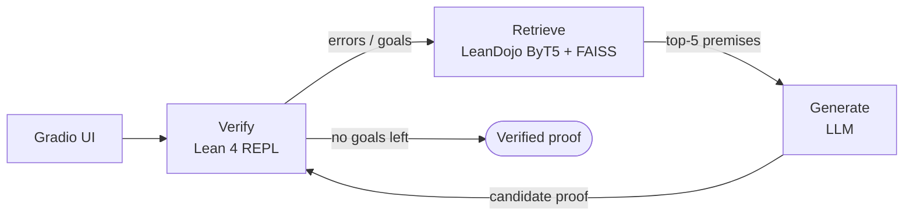

# Lean 4 Proof Assistant

An AI agent that completes formal mathematical proofs in **Lean 4**. Paste a theorem containing `sorry`, and the agent retrieves relevant Mathlib lemmas, drafts a proof with an LLM, and verifies it with the Lean compiler — retrying with error feedback until the proof checks or retries run out.

The core guarantee: **only Lean decides correctness.** Every accepted proof is formally verified by the Lean 4 REPL, so the system structurally cannot return a hallucinated proof.

**[Try it on Hugging Face Spaces →](https://huggingface.co/spaces/Ray5th/lean4-helper)**

## How it works



A LangGraph state machine drives a `verify → retrieve → generate` loop:

1. **Verify** — the file is checked by the Lean 4 REPL (via [lean-interact](https://github.com/augustepoiroux/LeanInteract)) with Mathlib available. Open goals and errors are extracted.
2. **Retrieve** — the current proof state (goals only, canonical `h : T ⊢ goal` form) is embedded with **LeanDojo's pretrained ByT5 premise retriever** and searched against a FAISS index of **180,973 Mathlib premises**. The index is IVFPQ-compressed, so 1.06 GB of raw embeddings ship as a 17 MB file via Git LFS.
3. **Generate** — retrieved premises are passed to the LLM as *optional hints* (RAFT-style distractor-aware framing), and the model must cite which lemmas it actually used (`-- used: Nat.add_comm`). The generated proof goes back to step 1.

Lean error messages feed the LLM prompt on retry but are kept out of the retrieval query — the encoder was trained on clean proof states, and error text degrades the embedding.

## Supported models

| Provider | Models | Notes |
|---|---|---|
| **Groq** (default) | `openai/gpt-oss-120b`, `openai/gpt-oss-20b`, `qwen/qwen3-32b`, `meta-llama/llama-4-scout-17b-16e-instruct` | Needs `GROQ_API_KEY` (Space secret / env var) |
| **Anthropic** | Claude Opus 4.7 · Sonnet 4.6 · Haiku 4.5 | Bring-your-own key in the UI; never stored |
| **Claude CLI** | `claude-cli-opus` etc. | Local `claude -p` subprocess — bills a Claude Pro subscription instead of API credits |

## Running locally

```bash
git clone https://github.com/ray5th/lean4-helper && cd lean4-helper
pip install -r requirements.txt
git lfs pull                          # fetch the FAISS index
python scripts/setup_lean.py          # one-time Lean + Mathlib warmup (slow first run)
export GROQ_API_KEY=...               # or use a Claude key / CLI in the UI
python app.py                         # Gradio UI on :7860
```

CLI instead of UI:

```bash
python scripts/run_agent.py problems/simple_add.lean --model openai/gpt-oss-120b
```

Benchmark on local problem files or MiniF2F:

```bash
python scripts/benchmark.py --problems-dir problems --retries 3 --verbose
python scripts/benchmark.py --subset 20 --model claude-cli-opus   # MiniF2F via HF datasets
```

## Benchmarks (small-sample, honest numbers)

| Set | Result | Notes |
|---|---|---|
| 16 intro lecture problems (calc / linarith / ring) | 16/16 | 15 solved on first generation |
| 6 harder problems (named-lemma, induction, divisibility) | 6/6 | retrieved-lemma citations fired on 4/6 |
| MiniF2F sample (5 AMC/AIME problems) | 3/5 | competition-grade; n far too small to quote as a pass rate |

## Project structure

```
app.py                       Gradio UI (two-pane editor, model picker, logs)
src/
  langgraph_agent.py         verify→retrieve→generate state machine
  lean_verifier.py           Lean 4 REPL wrapper (lean-interact)
  retriever.py               FAISS retrieval over Mathlib premises
  byt5_embedder.py           LeanDojo ByT5 encoder wrapper
  rag_chain.py               prompts + LLM provider routing (Groq/Anthropic/CLI)
  mathlib_corpus.py          Mathlib source → premise extraction
scripts/
  build_leandojo_index.py    build the IVFPQ FAISS index from LeanDojo embeddings
  benchmark.py               pass@k benchmark (local files or MiniF2F)
  run_agent.py               CLI entry point
  setup_lean.py              one-time Lean + Mathlib warmup
problems/                    sample .lean problems
tests/                       ~110 unit/fuzz tests (mocked LLM + Lean)
```

## Testing & CI

```bash
python -m unittest discover -s tests   # full suite, no API keys or Lean needed
ruff check .
```

GitHub Actions runs lint + tests on every push and auto-deploys to the Space on merge to `main` (when `HF_TOKEN` is configured).
